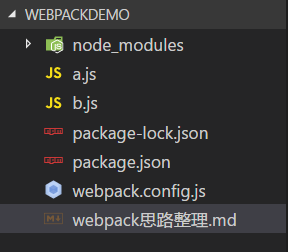

# webpack 使用思路整理(单页面应用)

## 基本思路

1. 按照前端的一般思路，一个工具可以装到全局也可以装到项目里，按照我的一般习惯，想让别人按照我的做法来的就装到项目里，只有我自己用的我就装到全局，所以 webpack 肯定要装到本地。所以起手式为

   1. `mkdir webpackdemo`
   1. `code webpackdemo`
   1. `npm init`
   1. 自己看着填填就好，这里有一个要注意的地方就是项目的名称不能与依赖的名称相同。
   1. `npm i -D webpack`

1. 安装好依赖之后，执行一下 webpack 这个命令`./node_modules/.bin/webpack`，看看是啥样子的。

   1. 为了避免每次都写依赖路径来执行，那么可以将执行命令写到 npm 脚本中，然后就会自动查找路径进行执行。`"dev": "webpack"`
   1. 执行完之后提示缺少配置文件，所以在根目录下建立`webpack.config.js`配置文件
   1. 再重新执行一下`npm run dev`，发现报错为需要配置 output.filename，这时候就需要看文档了

1. 当前文件夹的状态是



1. webpack 的基本配置

```js
module.exports = {
  entry: "./a.js", //入口，可以是一个字符串，也可以是一个数组或者对象
  output: {
    filename: "b.js" //打包完成后的文件名
  }
};
```

1. 执行一下`npm run dev`，可以看到 a.js 会被打包到 b.js 中，上边图中的 b.js 就是生成的，不用自己新建。
1. 现在存在一个问题，就是每次改动代码之后需要手动进行打包，这个时候就需要搜一下热更新，然后 webpack 提供了一个`webpack-dev-server`的模块

   1. 安装模块`npm i -D webpack-dev-server`
   1. 查看文档，写到 npm 脚本里。`webpack-dev-server --devtool eval --progress --colors --hot`

1. 执行完之后发现确实是可以打包，并且在修改代码之后会重新打包。但是问题来了，脚本打包完成了，但是咱们开发的是网页，应该是看到网页更新。但是现在入口文件是 js，和 html 没有关系。webpack 提供了一个插件`npm install --save-dev html-webpack-plugin`。安装完成之后进行配置：

```js
   plugins: [
     new HtmlWebpackPlugin({
       title: 'name'
     })
   ],
```

## 用到的东西

1. `postcss` 1. `postcss-trangle`可以通过简单的语法进行三角形的书写
   ```css
   .isosceles-triangle {
    triangle: pointing-<up|down|left|right>;
    width: <length>;
    height: <length>;
    background-color: <color>;
   }
   .right-isosceles-triangle {
      triangle: right-iso pointing-<up|down|left|right>;
      <width|height>: <length>;
      background-color: <color>;
    }
   .equilateral-triangle {
      triangle: equilateral pointing-<up|down|left|right>;
      <width|height>: <length>;
      background-color: <color>;
    }
    ```
